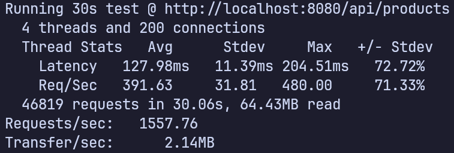

<p align="center">
  <a href="https://laravel.com" target="_blank">
    
  </a>
</p>

<h2 align="center">Laravel Flash Sale Application</h2>

## Technologies and Patterns used
- Used FrankenPHP & Caddy as web server.
- Used Repository design pattern to handle database operations.
- Used service layer to abstract logic from controllers.
- Used DTOs to transfer data between layers.
- Used transactions to ensure data consistency.
- Unified json response format by using a custom response trait.
- Used jobs to handle expired holds.

## Stress Test Result

<p align="start">
  
</p>

## Endpoints

### Products
- GET [/api/products](http://localhost:8080/api/products)
- GET [/api/products/{id}](http://localhost:8080/api/products/{id})

### Holds
- GET [/api/holds](http://localhost:8080/api/holds)
- GET [/api/holds/{id}](http://localhost:8080/api/holds/{id})
- POST [/api/holds](http://localhost:8080/api/holds) { product_id, qty }

### Orders
- GET [/api/orders](http://localhost:8080/api/orders) 
- GET [/api/orders/{id}](http://localhost:8080/api/orders/{id})
- POST [/api/orders](http://localhost:8080/api/orders) { hold_id }
- PUT [/api/orders/{id}/payment/webhook](http://localhost:8080/api/orders/{id}/payment/webhook) { status: pending, paid, failed, cancelled }


## Clone the Repository

````bash
git clone https://github.com/MHJaafar9869/Flash-Sale
cd flash-sale
````

## Installation Instructions

### Option 1: Using Docker (Recommended)

**Prerequisites**: Docker, Docker Compose

1. **Build the Docker Images**

```bash
docker compose build
```

2. **Start Containers**

```bash
docker compose up -d
```

3. **Access the Application**

* API: [http://localhost:8080/api](http://localhost:8080/api)
* PhpMyAdmin: [http://localhost:81](http://localhost:81)

---

**Notes**:

* `.env` is automatically generated from `.env.test` inside Docker.
* Database migrations and seeding are run automatically if `AUTO_MIGRATE` in `.env.test` is set to `true`.

---

### Option 2: Using Composer (Without Docker)

**Prerequisites**: PHP 8.4+, Composer, MySQL

1. **Install PHP dependencies**

```bash
composer install
```

2. **Setup Environment**

```bash
cp .env.example .env
php artisan key:generate
```

Configure database and cache settings in `.env`.

3. **Run Migrations & Seed Database**

```bash
php artisan migrate --seed
```

4. **Run the Application**

```bash
php artisan serve
```

Access: [http://localhost:8080](http://localhost:8080)


## Testing

```bash
php artisan test
OR
composer test
```
